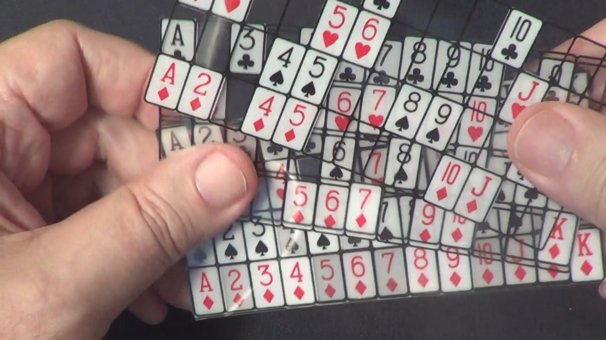

# Computer mind reading card

A while ago, my sister showed me an interesting game, when she
came back from the school's magic club.
I don't know it's official name. I see somebody call it "computer mind
reading card", or "perspective cards set".

{#fig-product}

# Let's play first

To demonstrate how the game works, let's first play it.

- Pick a card from a standard 52-card deck and keep it in mind.
- 8 tables in series will appear on the screen. Each time, simply
  press `y` if you see your card, or `n` if you don't.
- Keep answering, and the game will guess your card in no time!
- You can always refresh the page to restart the game if you pressed
  the wrong button.

::: {.callout-note}
To play the game, **WebGL2** support in your browser is required.
The source code can be found in [this blog's repository](https://github.com/Bowen951209/bowen-blog).
If you are unable to run it in your browser, you can try to build and run locally.
:::

```{=html}
<div style="display: flex; justify-content: center; align-items: center; margin: 20px 0; width: 100%;">
    <canvas id="glcanvas" tabindex='1' width="800" height="600" style="max-width: 100%; height: auto; border: 1px solid #ccc;"></canvas>
</div>
<script src="gl.js"></script>
<script>load("apps.wasm");</script>
```

Do you have your card guessed correctly? It should, in theory.

# Why it works?

Now, I will explain how the tables are designed, i.e., how do we
decide which card put in which table, to make the game work.

Some people may first come up with this:

    We have 52 cards in total. It is sufficient to represent each of
    them by a combination of the 8 tables. For
$$
\binom{8}{3} = 56 \geq 52.
$$

That is indeed the key.

::: {.callout-note}
To ensure we are on the same page, $\binom{8}{3}$ is the notation for
*8 choose 3*. Or, the count of combinations choosing $3$ individaul
items from $8$ individaul items.
:::

## Why $\binom{8}{3}$?

Why do we arrange $8$ tables, and choose $3$ of them for a card?
In fact, $\binom{8}{3}$ is the minimal solution for $n$ and $k$ such
that
$$
\binom{n}{k} \geq 52.
$$

It is easier to see in this table:

| $n$ | $k$        | $\binom{n}{k}$    |
| --- | ---------- | ----------------- |
| 1   | 1          | 1                 |
| 2   | 1          | 2                 |
| 3   | 1          | 3                 |
| 4   | 1, 2       | 4, 6              |
| 5   | 1, 2       | 5, 10             |
| 6   | 1, 2, 3    | 6, 15, 20         |
| 7   | 1, 2, 3    | 7, 21, 35         |
| 8   | 1, 2, 3, 4 | 8, 28, **56**, 70 |
...

## What do we need?

As you may have realized, the way the game find out your card is to
overlay the three tables that does not contain your card. Then, the
only missing card is the answer. Thus, let's say, for the table
combination that represents card "club A", at least one of the three
tables contains "club 2", same for "club 3", "club 4", and all the
other cards.

So we must design a layout that:

1. A unique combination of tables is arranged for each 52 cards.
2. That combination has only one *hole* of that card. i.e. There's
   only one card that all the tables in the combination don't contain.

### The solution

If we *choose the same number* for representation for each card, that
ensures any other cards have at least one of the three tables containing
it (requirement 2) See @fig-cross-table. Also, $\binom{8}{3} \geq 52.$ (requirement 1)

```{typst}
//| align: center
//| label: fig-cross-table
//| cap: "There are eight tables, A to H. A *cross* means the card is contained in the table. As you can see, for example, the tables not containing "Spade A" must contain any other cards. Because of choosing the same number of tables to contain for all cards."

#import "@preview/cetz:0.5.1"
#set page(fill: rgb("#ffffff"))

#cetz.canvas({
  import cetz.draw: *
  
  let cols = 9
  let rows = 6
  let cell-width = 1.6
  let cell-height = cell-width

  let total-width = cols * cell-width
  let total-height = rows * cell-height

  for i in range(0, cols + 1) {
    line((i * cell-width, 0), (i * cell-width, total-height), stroke: 0.5pt)
  }

  for j in range(0, rows + 1) {
    line((0, j * cell-height), (total-width, j * cell-height), stroke: 0.5pt)
  }

  let labels = ("A", "B", "C", "D", "E", "F", "G", "H")
  
  for i in range(0, cols - 1) {
    let x-center = (i + 1 + 0.5) * cell-width
    let y-center = total-height - (0.5 * cell-height)
    
    content((x-center, y-center), text(size: 20pt)[#labels.at(i)])
  }

  let filled = (
    (3, 4, 5, 6, 7),
    (2, 4, 5, 6, 7),
    (2, 3, 5, 6, 7),
    (2, 3, 4, 6, 7),
    (2, 3, 4, 5, 7),
  )

  for (r, cols-to-mark) in filled.enumerate() {
    for c in cols-to-mark {
      let x1 = (c + 1) * cell-width
      let x2 = (c + 2) * cell-width
      let y1 = total-height - (r + 2) * cell-height
      let y2 = total-height - (r + 1) * cell-height

      let pad = 0.15 * cell-width
      line((x1 + pad, y1 + pad), (x2 - pad, y2 - pad), stroke: 0.8pt)
      line((x1 + pad, y2 - pad), (x2 - pad, y1 + pad), stroke: 0.8pt)
    }
  }

  let cards = ("🂡", "🂢", "🂣", "🂤", "🂥").rev()

  for i in range(1, rows) {
    let x-center = 0.5 * cell-width
    let y-center = (i - 0.5) * cell-height
    
    content((x-center, y-center), text(size: 20pt)[#cards.at(i - 1)])
  }

  content((total-width * 0.5, -0.4), [#text(18pt)[⋮]])
})
```

---

Actually, requirement 2 is optional. That is, *not* choosing a
fixed number of tables to represent each indiviual cards is also
possible. You can still pick a set of tables and identify which card
it represents. However, that may cause a representation having multiple
holes:

```{typst}
//| align: center
//| label: fig-cross-table
//| cap: ""Spade A" has four holes, and "Spade 2" has three holes. If we find the tables for "Spade 2". Apart from having a hole of "Spade 2", they also have a hole of "Spade A". You can still identify this combination is "Spade 2", though."

#import "@preview/cetz:0.5.1"
#set page(fill: rgb("#ffffff"))

#cetz.canvas({
  import cetz.draw: *
  
  let cols = 9
  let rows = 3
  let cell-width = 1.6
  let cell-height = cell-width

  let total-width = cols * cell-width
  let total-height = rows * cell-height

  for i in range(0, cols + 1) {
    line((i * cell-width, 0), (i * cell-width, total-height), stroke: 0.5pt)
  }

  for j in range(0, rows + 1) {
    line((0, j * cell-height), (total-width, j * cell-height), stroke: 0.5pt)
  }

  let labels = ("A", "B", "C", "D", "E", "F", "G", "H")
  
  for i in range(0, cols - 1) {
    let x-center = (i + 1 + 0.5) * cell-width
    let y-center = total-height - (0.5 * cell-height)
    
    content((x-center, y-center), text(size: 20pt)[#labels.at(i)])
  }

  let filled = (
    (4, 5, 6, 7),
    (3, 4, 5, 6, 7),
  )

  for (r, cols-to-mark) in filled.enumerate() {
    for c in cols-to-mark {
      let x1 = (c + 1) * cell-width
      let x2 = (c + 2) * cell-width
      let y1 = total-height - (r + 2) * cell-height
      let y2 = total-height - (r + 1) * cell-height

      let pad = 0.15 * cell-width
      line((x1 + pad, y1 + pad), (x2 - pad, y2 - pad), stroke: 0.8pt)
      line((x1 + pad, y2 - pad), (x2 - pad, y1 + pad), stroke: 0.8pt)
    }
  }

  let cards = ("🂡", "🂢").rev()

  for i in range(1, rows) {
    let x-center = 0.5 * cell-width
    let y-center = (i - 0.5) * cell-height
    
    content((x-center, y-center), text(size: 20pt)[#cards.at(i - 1)])
  }

  content((total-width * 0.5, -0.4), [#text(18pt)[⋮]])
})
```
